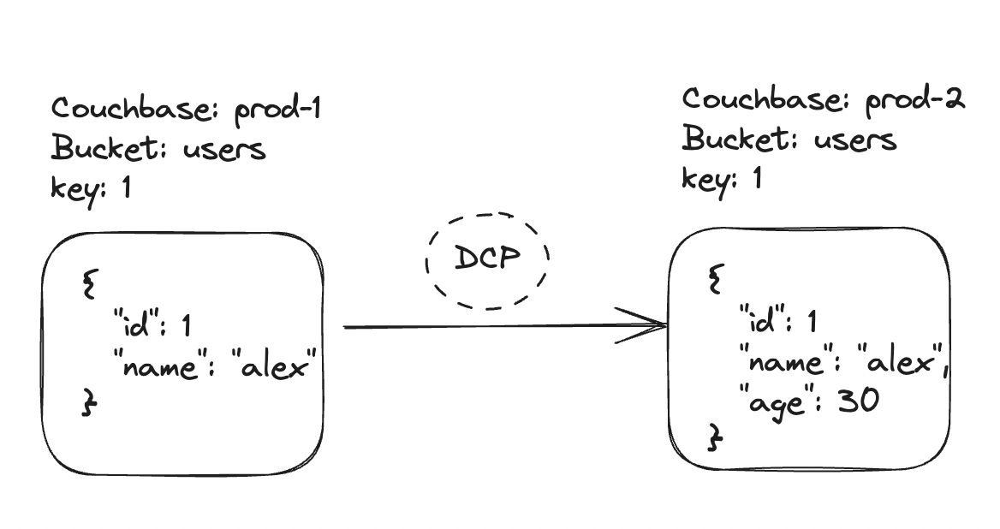
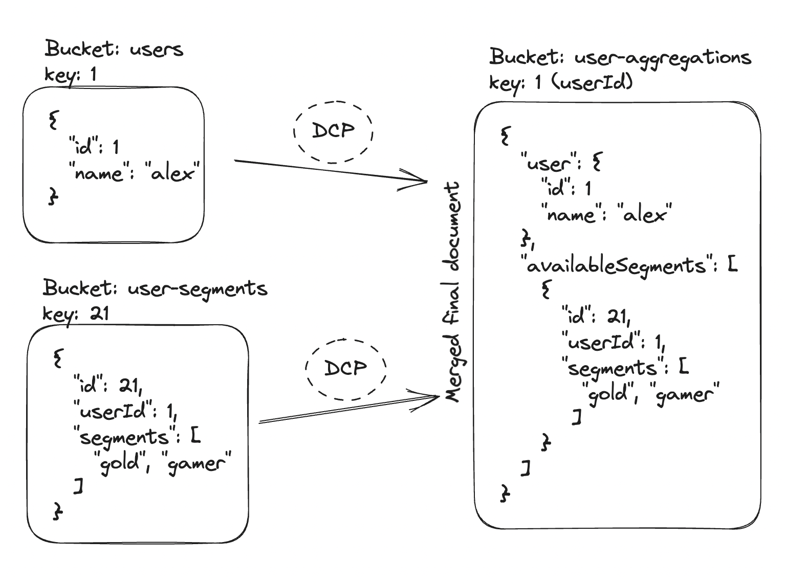

# Go Dcp Couchbase [](https://pkg.go.dev/github.com/Trendyol/go-dcp-couchbase) [](https://goreportcard.com/report/github.com/Trendyol/go-dcp-couchbase) [](https://scorecard.dev/viewer/?uri=github.com/Trendyol/go-dcp-couchbase)

**Go Dcp Couchbase** streams documents from Couchbase Database Change Protocol (DCP) and writes to
Couchbase bucket in near real-time.

## Features

* **Less resource usage** and **higher throughput**.
* **Update multiple documents** for a DCP event(see [Example](#example)).
* Handling different DCP events such as **expiration, deletion and mutation**(see [Example](#example)).
* **Managing batch configurations** such as maximum batch, batch bytes, batch ticker durations.
* **Scale up and down** by custom membership algorithms(Couchbase, KubernetesHa, Kubernetes StatefulSet or
  Static, see [examples](https://github.com/Trendyol/go-dcp#examples)).
* **Easily manageable configurations**.
* **See example package for mutateIn value with primitive types** see [Example](example/custom-mapper-with-primitives)).

## Concepts
General Concept


Merge at target bucket



## Example

[Struct Config](example/struct-config/main.go)

```go
package main

import (
  "github.com/Trendyol/go-dcp-couchbase"
  "time"

  "github.com/Trendyol/go-dcp-couchbase/config"
  dcpConfig "github.com/Trendyol/go-dcp/config"
)

func main() {
  c, err := dcpcouchbase.NewConnectorBuilder(&config.Config{
    Dcp: dcpConfig.Dcp{
      Hosts:      []string{"localhost:8091"},
      Username:   "user",
      Password:   "password",
      BucketName: "dcp-test",
      Dcp: dcpConfig.ExternalDcp{
        Group: dcpConfig.DCPGroup{
          Name: "groupName",
          Membership: dcpConfig.DCPGroupMembership{
            RebalanceDelay: 3 * time.Second,
          },
        },
      },
      Metadata: dcpConfig.Metadata{
        Config: map[string]string{
          "bucket":     "dcp-test-meta",
          "scope":      "_default",
          "collection": "_default",
        },
        Type: "couchbase",
      },
      Debug: true,
    },
    Couchbase: config.Couchbase{
      Hosts:          []string{"localhost:8091"},
      Username:       "user",
      Password:       "password",
      BucketName:     "dcp-test-backup",
      BatchSizeLimit: 10,
      RequestTimeout: 10 * time.Second,
    },
  }).SetMapper(dcpcouchbase.DefaultMapper).Build()
  if err != nil {
    panic(err)
  }

  defer c.Close()
  c.Start()
}
```

## Configuration

### Dcp Configuration

Check out on [go-dcp](https://github.com/Trendyol/go-dcp#configuration)

### Couchbase Specific Configuration

| Variable                         | Type          | Required | Default         | Description                                                                                         |                                                           
|----------------------------------|---------------|----------|-----------------|-----------------------------------------------------------------------------------------------------|
| `couchbase.hosts`                | []string      | yes      |                 | Couchbase connection urls                                                                           |
| `couchbase.username`             | string        | yes      |                 | Defines Couchbase username                                                                          |
| `couchbase.password`             | string        | yes      |                 | Defines Couchbase password                                                                          |
| `couchbase.bucketName`           | string        | yes      |                 | Defines Couchbase bucket name                                                                       |
| `couchbase.scopeName`            | string        | no       | _default        | Defines Couchbase scope name                                                                        |
| `couchbase.collectionName`       | string        | no       | _default        | Defines Couchbase collection name                                                                   |
| `couchbase.batchSizeLimit`       | int           | no       | 2048            | Maximum message count for batch, if exceed flush will be triggered.                                 |
| `couchbase.batchTickerDuration`  | time.Duration | no       | 10s             | Batch is being flushed automatically at specific time intervals for long waiting messages in batch. |
| `couchbase.batchByteSizeLimit`   | int, string   | no       | 10mb            | Maximum size(byte) for batch, if exceed flush will be triggered. `10mb` is default.                 |
| `couchbase.maxInflightRequests`  | int           | no       | $batchSizeLimit | Maximum request count for Couchbase                                                                 |
| `couchbase.writePoolSizePerNode` | int           | no       | 1               | Write connection pool size per node                                                                 |
| `couchbase.requestTimeout`       | time.Duration | no       | 1m              | Maximum request waiting time                                                                        |
| `couchbase.secureConnection`     | bool          | no       | false           | Enables secure connection.                                                                          |
| `couchbase.rootCAPath`           | string        | no       | false           | Defines root CA path.                                                                               |
| `couchbase.connectionBufferSize` | uint          | no       | 20971520        | Defines connectionBufferSize.                                                                       |
| `couchbase.connectionTimeout`    | time.Duration | no       | 1m              | Defines connectionTimeout.                                                                          |

## Exposed metrics

For DCP related metrics see [also](https://github.com/Trendyol/go-dcp#exposed-metrics).

## Breaking Changes

| Date taking effect | Date announced    | Change                                               | How to check    |
|--------------------|-------------------|------------------------------------------------------|-----------------|
| December 29, 2023  | December 29, 2023 | Mapper first arg changed to `couchbase.EventContext` | Compile project |
| November 14, 2023  | November 14, 2023 | Creating connector via builder                       | Compile project |

## Contributing

Go Dcp Couchbase is always open for direct contributions. For more information please check
our [Contribution Guideline document](./CONTRIBUTING.md).

## License

Released under the [MIT License](LICENSE).
